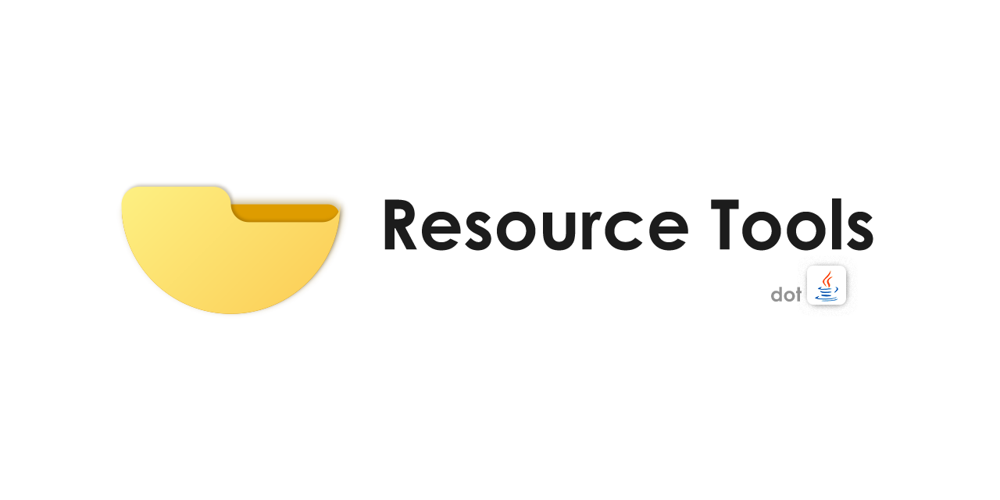

A tool lib for easily getting the resources in your classpath (dir or jar)!

[badge_release_img]: https://img.shields.io/github/v/release/Eyre-S/ResourceTools?display_name=release&label=latest&color=#00fa9a
[badge_release_target]: https://mvn.sukazyo.cc/#/releases/cc/sukazyo/resource-tools
[badge_tests_img]: https://img.shields.io/github/actions/workflow/status/Eyre-S/ResourceTools/test?label=Tests&color=dark-green
[badge_snapshot_img]: https://img.shields.io/maven-metadata/v?metadataUrl=https%3A%2F%2Fmvn.sukazyo.cc%2Fsnapshots%2Fcc%2Fsukazyo%2Fresource-tools%2Fmaven-metadata.xml&label=snapshots&color=%231e90ff
[badge_snapshot_target]: https://mvn.sukazyo.cc/#/snapshots/cc/sukazyo/resource-tools
[![GitHub release][badge_release_img]][badge_release_target]
![GitHub Workflow Status of test][badge_tests_img]
[![Maven metadata of snapshots][badge_snapshot_img]][badge_snapshot_target]

---

#### NOTICE
v0.3.x has VERY BIG differences with the v0.2.x.

---

 

## Introduction

ResourceTools is a project that allows developers, especially new Java developers, to no longer have the problem of getting resource files with full of problems in Java.

Through this toolkit, you can use `resources/` in your classpath just like using `java.io.File` in disk. Whether before or after packaging, you can always get resources with a piece of code.

## Usage

See [Wiki](https://github.com/Eyre-S/ResourceTools/wiki).

## License & Contribute

This project is under Apache 2.0 License.

Feel free to contribute / submit an issue to anything.

## Thanks To

Thanks to Stapx Steve allows me writing the previous versions README file based on his project [SS Tool Box](https://github.com/Stapxs/SS-Tool-Box).

Thanks for your stars and watches and followers~!

## End

In the end, thanks to everyone supporting me in the past years. This project is my FIRST project has some real purpose, also my FIRST project I am going to do it for the public.

I am using this project v0.2.x in those years in many my other projects, although it is very immature and has many bugs. So I decide to update, or says to remake this project now. I kept the old Thanks To paragraphs, and there's *"If there is anything that the describing is not suitable for, just [post an issue](https://github.com/Eyre-S/ResourceTools/issues). If you have any other questions, just [post issue](https://github.com/Eyre-S/ResourceTools/issues) too"* in the old README, I think it suits for now too.
